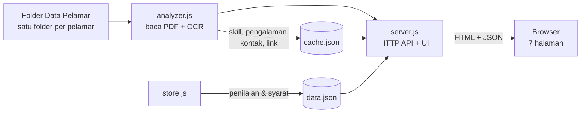

<div align="center">

# 🎯 Talent Pool — Recruitment Dashboard & Mini-ATS

### Sistem rekrutmen berbasis web untuk menyaring, menilai, dan mengelola pelamar **Fullstack Developer** — lengkap dengan analisis CV otomatis, perankingan pengalaman, pencocokan lowongan, papan seleksi (Kanban), analitik, dan undangan grup WhatsApp.

<br/>


<br/>

**Dibangun tanpa framework berat** — hanya Node.js inti + 3 pustaka untuk membaca PDF & OCR. Ringan, cepat, dan tanpa database.

</div>

---

## 📑 Daftar Isi

- [✨ Fitur Utama](#-fitur-utama)
- [🖼️ Tampilan](#️-tampilan)
- [🏗️ Arsitektur](#️-arsitektur)
- [🚀 Instalasi & Menjalankan](#-instalasi--menjalankan)
- [📂 Data Pelamar (Google Drive)](#-data-pelamar-google-drive)
- [⚙️ Konfigurasi](#️-konfigurasi)
- [🧭 Halaman & Route](#-halaman--route)
- [🧠 Cara Kerja Analisis](#-cara-kerja-analisis)
- [🗂️ Struktur Proyek](#️-struktur-proyek)
- [🛠️ Teknologi](#️-teknologi)
- [⚠️ Disclaimer & Privasi](#️-disclaimer--privasi)
- [📜 Lisensi](#-lisensi)

---

## ✨ Fitur Utama

| Modul | Deskripsi |
|------|-----------|
| 📊 **Dashboard** | Menu utama + statistik ringkas seluruh pelamar. |
| 👥 **Daftar Pelamar** | Semua kandidat + dokumen (CV, portofolio, SKCK, ijazah). Penampil PDF/gambar bawaan, pencarian nama & **skill**, tombol langsung ke **GitHub / LinkedIn / Website**. |
| 🏆 **Perankingan** | Membaca isi CV dan **memperkirakan lama pengalaman di bidang IT** dari rentang tanggal kerja & klaim eksplisit, lalu mengurutkan kandidat — lengkap dengan **bukti** & confidence. Tahun pendidikan/organisasi otomatis dikecualikan. |
| 🎯 **Pencocokan Lowongan** | Tentukan syarat (skill wajib, min. pengalaman, pendidikan, **bobot**) → sistem menghitung **% kecocokan** tiap pelamar untuk shortlist objektif. |
| 📋 **Papan Seleksi (Kanban)** | Pipeline tahapan (Baru → Wawancara → Diterima/Ditolak) dengan **seret-tempel**. Beri **rating, kriteria, tag, catatan, favorit** per kandidat. |
| 📈 **Analitik & Laporan** | Grafik sebaran pengalaman, skill terpopuler, pendidikan, status pipeline. **Export Excel/CSV** & **Cetak PDF**. |
| 💬 **Undang Grup WA** | Mengambil **nomor WhatsApp** tiap pelamar dari CV, lalu mengirim undangan grup berisi pesan personal via klik-untuk-chat — plus ekspor **vCard/CSV**. |
| 🔎 **OCR CV Scan** | CV berupa hasil scan/gambar bisa dibaca dengan OCR (on-demand). |
| 🌗 **Tema Terang/Gelap** | Beralih tema dengan satu klik, tersimpan otomatis. Sepenuhnya **responsif** (desktop & mobile). |

---

## 🖼️ Tampilan

> 💡 Tambahkan tangkapan layar Anda sendiri ke folder `docs/` lalu tautkan di sini, contoh:
> ``

| Dashboard | Perankingan | Papan Seleksi |
|:---:|:---:|:---:|
| _screenshot_ | _screenshot_ | _screenshot_ |

---

## 🏗️ Arsitektur



- **Tanpa database** — status & penilaian disimpan di `data.json`; hasil analisis CV di-cache di `cache.json`.
- **Tanpa build step** — UI di-render langsung dari `server.js` (HTML+CSS+JS murni).

---

## 🚀 Instalasi & Menjalankan

### Prasyarat
- **Node.js 18 atau lebih baru** — [unduh di sini](https://nodejs.org/). Cek dengan: `node --version`
- **Git** (untuk clone)

### Langkah

```bash
# 1. Clone repository
git clone https://github.com/RokiFauziErenJaegar/talent-pool-ats.git
cd talent-pool-ats

# 2. Pasang dependency
npm install

# 3. Siapkan data pelamar (lihat bagian "Data Pelamar" di bawah)
#    Letakkan folder-folder pelamar di dalam ./data

# 4. Jalankan
PELAMAR_DIR=./data npm start
```

> **Windows (PowerShell):**
> ```powershell
> $env:PELAMAR_DIR=".\data"; npm start
> ```
> Atau cukup **klik dua kali `start.bat`** (sudah memuat path Node otomatis).

Lalu buka **http://localhost:3000** 🎉

---

## 📂 Data Pelamar (Google Drive)

Aplikasi ini **tidak menyertakan data pelamar** demi privasi. Unduh dari Google Drive berikut:

### 📥 **[Unduh Data Pelamar Fullstack](https://drive.google.com/drive/folders/1hGXNju7DkgERkwYfcz9HCg4PbDmKdlNQ?usp=drive_link)**

> `https://drive.google.com/drive/folders/1hGXNju7DkgERkwYfcz9HCg4PbDmKdlNQ?usp=drive_link`

**Cara pakai:**
1. Unduh seluruh folder dari Drive di atas.
2. Ekstrak sehingga setiap pelamar menjadi **satu subfolder** di dalam `./data`:

```
data/
├── Budi Santoso/
│   ├── CV_Budi.pdf
│   └── Portofolio_Budi.pdf
├── Siti Aminah/
│   └── CV - Siti.pdf
└── ...
```
3. Jalankan dengan `PELAMAR_DIR=./data`.

Aplikasi mendeteksi otomatis: CV, Portofolio, SKCK, Ijazah & Transkrip, Surat Lamaran, Surat Sehat, Sertifikat, Foto, KTP.

---

## ⚙️ Konfigurasi

Semua opsional. Set lewat environment atau berkas `.env` (salin dari `.env.example`).

| Variabel | Default | Keterangan |
|----------|---------|-----------|
| `PELAMAR_DIR` | `./data` (bila ada isinya) atau folder induk | Lokasi folder data pelamar. |
| `PORT` | `3000` | Port server HTTP. |

---

## 🧭 Halaman & Route

| Route | Halaman | Fungsi |
|-------|---------|--------|
| `/` | Dashboard | Menu utama & statistik |
| `/pelamar` | Daftar Pelamar | Dokumen, skill, link, penilaian |
| `/ranking` | Perankingan | Estimasi pengalaman IT + OCR |
| `/cocok` | Pencocokan Lowongan | Skor kecocokan vs syarat |
| `/seleksi` | Papan Seleksi | Pipeline Kanban |
| `/analitik` | Analitik & Laporan | Grafik + export |
| `/undang` | Undang Grup WA | Kontak & undangan WhatsApp |

**API:** `GET /api/applicants`, `GET /api/ranking`, `GET /api/contacts`, `GET /api/data`, `POST /api/eval`, `POST /api/settings`, `POST /api/ocr`, `GET /file`.

---

## 🧠 Cara Kerja Analisis

- **Estimasi pengalaman** — mendeteksi rentang tanggal pekerjaan (`Mar 2023 – Sekarang`, `2016–2017`) dan klaim eksplisit ("± 3 tahun pengalaman"), menggabungkan interval yang tumpang tindih. Rentang **pendidikan & organisasi** diklasifikasikan via kata-kunci terdekat lalu **dikecualikan**.
- **Skill / tech-stack** — dicocokkan dari kamus teknologi (React, Laravel, Node.js, dll).
- **Kontak** — nomor WhatsApp Indonesia dinormalkan ke format `62…`; email & link GitHub/LinkedIn diekstrak.
- **Skor kecocokan** — gabungan berbobot dari skill, pengalaman, dan pendidikan terhadap syarat lowongan.
- **OCR** — untuk CV hasil scan, halaman PDF dirender ke gambar lalu dibaca dengan Tesseract (`ind+eng`).

> ⚠️ Hasil bersifat **perkiraan bantu**, bukan keputusan final. Setiap angka disertai bukti & tombol "Lihat CV" untuk verifikasi manusia.

---

## 🗂️ Struktur Proyek

```
talent-pool-ats/
├── server.js        # Server HTTP + seluruh UI (HTML/CSS/JS)
├── analyzer.js      # Mesin analisis CV (pengalaman, skill, kontak, OCR)
├── store.js         # Penyimpanan penilaian & pengaturan (data.json)
├── config.js        # Konfigurasi (lokasi data, port, .env loader)
├── data/            # Tempat data pelamar (tidak di-commit)
├── package.json
├── start.bat        # Peluncur cepat untuk Windows
├── .env.example
└── README.md
```

---

## 🛠️ Teknologi

| Komponen | Pilihan |
|----------|---------|
| Runtime | Node.js (modul `http` inti, tanpa Express) |
| Frontend | HTML + CSS + JavaScript murni (tanpa framework/build) |
| Baca PDF | [`pdf-parse`](https://www.npmjs.com/package/pdf-parse) |
| OCR | [`tesseract.js`](https://www.npmjs.com/package/tesseract.js) + [`pdf-to-img`](https://www.npmjs.com/package/pdf-to-img) |
| Penyimpanan | Berkas JSON (tanpa database) |
| Font/UI | Plus Jakarta Sans + Inter, tema gelap/terang |

---

## ⚠️ Disclaimer & Privasi

- 🔒 **Data pelamar adalah informasi pribadi.** Jangan pernah commit folder data, `cache.json`, atau `data.json` ke repositori publik — semuanya sudah dikecualikan via `.gitignore`.
- 📵 **WhatsApp** tidak mengizinkan menambah anggota grup secara otomatis tanpa persetujuan; fitur undangan memakai metode klik-untuk-chat yang sesuai kebijakan.
- 🤖 Estimasi pengalaman, skor kecocokan, dan OCR adalah **alat bantu pengambilan keputusan**, bukan penilaian mutlak — selalu verifikasi melalui CV asli.

---

## 📜 Lisensi

Dirilis di bawah lisensi **MIT** — lihat berkas [LICENSE](LICENSE).

<div align="center">

---

⭐ **Jika proyek ini bermanfaat, beri bintang di GitHub!** ⭐

Dibuat dengan ❤️ untuk proses rekrutmen yang lebih cepat, objektif, dan rapi.

</div>
